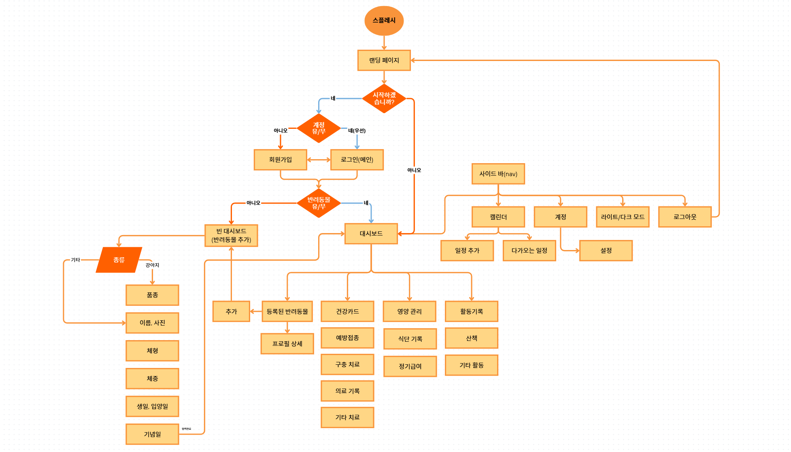
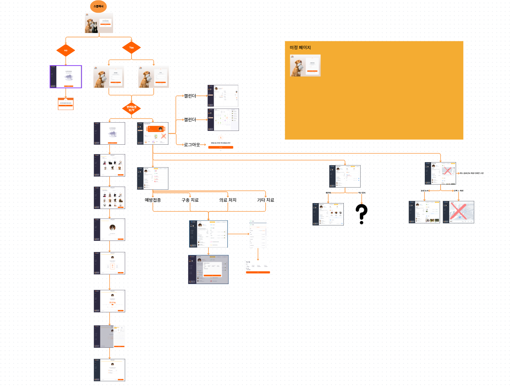

<!-- --------------------------------------------------------------------------------- -->

# 🐾 POW BUDDY - 반려동물 관리 웹 앱

## 📑 목차

- [🐾 POW BUDDY - 반려동물 관리 웹 앱](#-pow-buddy---반려동물-관리-웹-앱)
  - [📋 팀 요약 (한눈에 보기)](#-팀-요약-한눈에-보기)
  - [1️⃣ 프로젝트 개요](#1️⃣-프로젝트-개요)
    - [🎯 프로젝트 목적 & 목표](#-프로젝트-목적--목표)
  - [2️⃣ 핵심 기능](#2️⃣-핵심-기능)
    - [All-in-One 관리](#all-in-one-관리)
    - [사용자 편의성](#사용자-편의성)
    - [데이터 기반 기록](#데이터-기반-기록)
    - [서비스 주요 기능](#서비스-주요-기능)
  - [3️⃣ 기술 스택](#3️⃣-기술-스택)
  - [4️⃣ 아키텍처 / 페이지 구조](#4️⃣-아키텍처--페이지-구조)
  - [5️⃣ 참고 문서 & 링크](#5️⃣-참고-문서--링크)

## 📋 팀 요약 (한눈에 보기)

|  |  |  |  |
| :---------------------------------------------: | :---------------------------------------------: | :---------------------------------------------: | :---------------------------------------------: |
|                   **김동규**                    |                   **장효정**                    |                   **정지은**                    |                   **우혜리**                    |
|                 Frontend / 조장                 |                    Frontend                     |                    Frontend                     |                    Frontend                     |
|      [GitHub](https://github.com/cit1566)       |     [GitHub](https://github.com/{{github}})     |     [GitHub](https://github.com/{{github}})     |     [GitHub](https://github.com/{{github}})     |
|                cit1566@gmail.com                |               {{email@email.com}}               |               {{email@email.com}}               |               {{email@email.com}}               |

## 1️⃣ 프로젝트 개요

- **프로젝트명:** POW BUDDY
- **주제:** 반려동물 관리 서비스 웹 앱  
  반려동물의 건강, 식단, 일정 등을 한 곳에서 체계적으로 관리할 수 있는 웹 서비스입니다.

### 🎯 프로젝트 목적 & 목표

1인 가구 증가와 함께 반려동물을 키우는 가구도 증가하고 있습니다.  
이에 따라 반려동물 양육의 체계적 관리 필요성이 높아지고 있어, **일정·건강·식단 관리 통합 웹 서비스**를 목표로 프로젝트를 진행하였습니다.

---

## 2️⃣ 핵심 기능

### All-in-One 관리

- **일정 + 건강 + 식단 + 활동**을 하나의 플랫폼에서 통합 관리

### 사용자 편의성

- 직관적인 UI/UX
- 알림 기능 제공

### 데이터 기반 기록

- 반려동물의 건강·생활 이력을 **시각적으로 확인 가능**

### 서비스 주요 기능

- **반려동물 관리:** 등록, 프로필 관리, 건강 카드(예방접종, 구충제, 의료 기록 등)
- **일정 관리:** 캘린더(일정 추가, 다가오는 일정 확인)
- **활동 & 식단 관리:** 산책·플랜트랙 등 활동 기록, 식단 기록 및 알림

---

## 3️⃣ 기술 스택

| 구분           | 기술/도구                                                                                                                                                                                                                                                                                      | 설명                                              |
| -------------- | ---------------------------------------------------------------------------------------------------------------------------------------------------------------------------------------------------------------------------------------------------------------------------------------------- | ------------------------------------------------- |
| **Frontend**   |    | SSR/SSG 지원, 타입 안정성, 유틸리티 기반 스타일링 |
| **Backend**    |                                                                                          | 서버리스 API, 인증/실시간 DB 지원                 |
| **Database**   |                                                                                                        | 관계형 DB, SQL 기반, 실시간 구독 가능             |
| **Deployment** |                                                                                                                                                                                                            | Next.js 최적화 호스팅, 서버리스 함수, CI/CD 지원  |

- **Frontend:** Next.js, TypeScript, TailwindCSS
- **Backend:** Next.js API Routes, Supabase
- **Database:** Supabase(PostgreSQL 기반)
- **Deployment:** Vercel

---

## 4️⃣ 아키텍처 / 페이지 구조

- 서비스 전반적인 **페이지 흐름** 시각화

- 각 페이지별 **세부 구조** 정리

---

## 5️⃣ 참고 문서 & 링크

- [프로젝트 노션](https://www.notion.so/pALL-27873873401a8015a67cc3c56c3e8321?source=copy_link)
- [디자인 시안 (Figma)](https://www.figma.com/design/Ujxn7gdkda0dSpBUMwg5fg/pALL-%EB%94%94%EC%9E%90%EC%9D%B8-%EC%8B%9C%EC%95%88?node-id=1008-78018&p&t=DnK5PTgjhyUDzIi6-0)
- [배포 링크 - 미정]()

---
